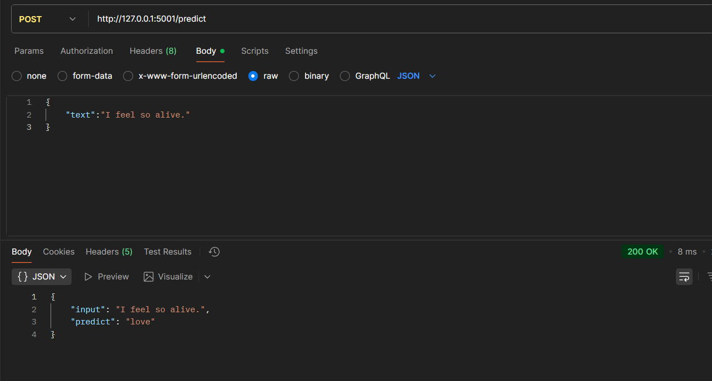

## MINI PROJECT

This repo is for Testing workflows of the model on Action


## Dependencies
```
flask
torch>=1.9.0
numpy<2
matplotlib>=3.4.0
seaborn>=0.11.0
scikit-learn
jupyter>=1.0.0
mlflow
pandas
requests
kagglehub
```

## Installation

First you have to clone this Repo into your device :

```bash
git clone https://github.com/zD0n/mlop_testing.git
```

In this case if you are using Anaconda enviroment you can

```bash
conda env create -f environment.yml
```

if you not there is a requirements.txt for you.

Don't forget to location to it first.
```bash
pip install -r requirements.txt
```

## Running

### Training

To train the model
```bash
python ./pipeline/scripts/Run_1_4.py <Model_name> <Epochs>
```

### Testing
To test the model

```bash
python ./pipeline/scripts/04_transition_model.py <model_name> <Text Eg. 'I Feel so alive.'>
```

### Deploy

In this part you have to try checking the app.py
or just run.
```bash
python ./pipeline/scripts/app.py
```

and then your model will be available at

http://127.0.0.1:5001

you test it working or not by using Postman
the result of it should look like this


## Ref

Just add something it make it not look so empty